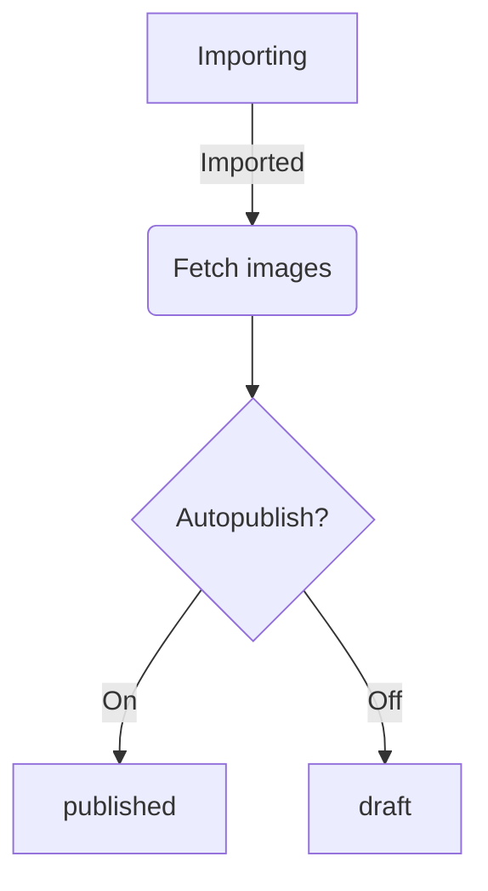

# Import Data Format

To import property, please folow JSON creation guide. All properties should reside in `items` array in `item` object.

```
Base URL is: https://nadjistan.ba/
```

## Item

| Section | Key                      | Description                                                                                                                                                                                                                                                                | Type                                 | Requiered |
| ------- | ------------------------ | -------------------------------------------------------------------------------------------------------------------------------------------------------------------------------------------------------------------------------------------------------------------------- | ------------------------------------ | --------- |
| `/`     | `internal_id`            | Internal ID from your system. Used to match item during update                                                                                                                                                                                                             | `int` \| `string`                    | Yes       |
| `/`     | `created`                | Item creation date on your system.                                                                                                                                                                                                                                         | `Y-m-d H:i:s`                        | No        |
| `/`     | `modified`               | Item modified date on your system.                                                                                                                                                                                                                                         | `Y-m-d H:i:s`                        | Yes       |
| `/`     | `io_estates_type`        | Item modified date on your system. Use `id` of [IO_EstatesType](#io_estatestype). At least one must be provided, and in some cases you can use two or more.                                                                                                                | `int[]`                              | Yes       |
| `/`     | `title`                  | Item title.                                                                                                                                                                                                                                                                | `string`                             | Yes       |
| `/`     | `content`                | Item description with basic HTML tags (`a`, `b`, `ul`, `ol`, `li` )                                                                                                                                                                                                        | `string` \| `html`                   | Yes       |
| `/meta` | `io_estates_currency`    | Sets price currency. Default is `BAM`.                                                                                                                                                                                                                                     | `EUR`\|`BAM`                         | No        |
| `/meta` | `io_estates_price`       | Price of item. If it is not provided, item will be bresented with 'Ask for price'                                                                                                                                                                                          | `double`                             | No        |
| `/meta` | `io_estates_address`     | Used to set street name and number                                                                                                                                                                                                                                         | `string`                             | No        |
| `/meta` | `io_estates_zip`         | ZIP code (eg. 78000)                                                                                                                                                                                                                                                       | `string`                             | No        |
| `/meta` | `io_estates_city`        | City of property                                                                                                                                                                                                                                                           | `string`                             | No        |
| `/meta` | `io_estates_region`      | Region of item                                                                                                                                                                                                                                                             | `string`                             | No        |
| `/meta` | `io_estates_state`       | State of item                                                                                                                                                                                                                                                              | `string`                             | No        |
| `/meta` | `io_estates_bathrooms`   | Number of bathrooms in the property                                                                                                                                                                                                                                        | `int`                                | No        |
| `/meta` | `io_estates_sqm`         | Property size in square meters                                                                                                                                                                                                                                             | `int`                                | No        |
| `/meta` | `io_estates_land`        | Land related to the property in square meters                                                                                                                                                                                                                              | `int`                                | No        |
| `/meta` | `io_estates_geo`         | Used to present position of property on the map.                                                                                                                                                                                                                           | {`lat`:`double`, `lng`:`double`},    | No        |
| `/meta` | `io_estates_mode`        | Declares desired action related to the property. Use `string` of [IO_EstatesMode](#io_estatesmode).                                                                                                                                                                        | `sell` \| `buy` \| `rent` \| `lease` | Yes       |
| `/meta` | `io_estates_payment`     | Defines payment interval if `io_estates_mode` is `lease` \| `rent`. Use `string` of [IO_EstatesPaymentInterval](#io_estatespaymentinterval).                                                                                                                               | `month` \| `day` \| `null`           | \*        |
| `/meta` | `io_estates_builded`     | If applicable, used to set year when the property is builded.                                                                                                                                                                                                              | `int`                                | No        |
| `/meta` | `io_estates_video`       | To include promo video, you can provide YouTube embed URL.                                                                                                                                                                                                                 | `URL`                                | No        |
| `/meta` | `io_estates_panorama360` | To present 360&deg; panorama, you can an URL.                                                                                                                                                                                                                              | `URL`                                | No        |
| `/`     | `io_estates_loc`         | Include in `id` from [IO_EstatesLoc](#io_estatesloc) to set location. If this is not set, system will try to resolve location on it's own by using `io_estates_city`, `io_estates_region` and `io_estates_state`. We strongly recommend that you provide this on your own. | `int`                                | Yes\*     |
| `/`     | `io_estates_rooms`       | Number of rooms in the property. Please be aware that you need to send an `id` of [IO_EstatesRooms](#io_estatesrooms)                                                                                                                                                      | `int`                                | No        |
| `/`     | `io_estates_floors`      | Defines floors of the property. Please be aware that you need to send an `id` of [IO_EstatesFloors](#io_estatesfloors)                                                                                                                                                     | `int`                                | No        |
| `/`     | `io_estates_level`       | Defines level of the property in the building. Please be aware that you need to send an `id` of [IO_EstatesLevel](#io_estateslevel)                                                                                                                                        | `int`                                | No        |
| `/`     | `io_estates_heating`     | Defines type of heating in the property. Please be aware that you need to send an `id` of [IO_EstatesHeating](#io_estatesheating)                                                                                                                                          | `int`                                | No        |
| `/`     | `io_estates_condition`   | Defines condition of the property. Please be aware that you need to send an `id` of [IO_EstatesCondition](#io_estatescondition)                                                                                                                                            | `int`                                | No        |
| `/`     | `io_estates_equip`       | Defines equiment in the property. Please be aware that you need to send an `id` of [IO_EstatesEquip](#io_estatesequip)                                                                                                                                                     | `int`                                | No        |
| `/`     | `io_estates_attr`        | Defines attributes of the property. Please be aware that you need to send an `id` of [IO_EstatesAttr](#io_estatesattr)                                                                                                                                                     | `int[]`                              | No        |
| `/`     | `io_estates_waste`       | Defines waste management in the property. Please be aware that you need to send an `id` of [IO_EstatesWaste](#io_estateswaste)                                                                                                                                             | `int`                                | No        |
| `/`     | `io_estates_storey`      | Defines storeys in the property. Please be aware that you need to send an `id` of [IO_EstatesStorey](#io_estatesstorey)                                                                                                                                                    | `int`                                | No        |
| `/`     | `images`                 | List of the URLs to the images which will be imported and attached to the item. It's recommended to include at least one (preferably 7), and can provide up to 15 URLs. We will show up to 7 images by default, and you can 'buy' additional images on the portal.         | `URL[]`                              | No        |

```json
{
  "items": [
    {
      "internal_id": 1000,
      "created": "2023-01-01 09:28:42",
      "modified": "2023-03-02 09:28:42",
      "io_estates_type": [8, 9],
      "title": "Amazing house for rent",
      "content": "Amazing apartment for rent content... We will accept simple HTML...",
      "meta": {
        "io_estates_currency": "EUR",
        "io_estates_price": 1200,
        "io_estates_address": "Durmitorska 18",
        "io_estates_zip": "11001",
        "io_estates_city": "Beograd",
        "io_estates_region": "Beograd",
        "io_estates_state": "Srbija",
        "io_estates_bathrooms": 1,
        "io_estates_sqm": 90,
        "io_estates_land": 250,
        "io_estates_geo": {
          "lat": 44.8003986,
          "lng": 20.4530811
        },
        "io_estates_mode": "rent",
        "io_estates_payment": "month",
        "io_estates_builded": 2023,
        "io_estates_video": "https://www.youtube.com/embed/dQw4w9WgXcQ",
        "io_estates_panorama360": "https://pixexid.com/image/cm1btua-360-image-of-a-room"
      },
      "io_estates_loc": 311,
      "io_estates_rooms": 39,
      "io_estates_floors": 44,
      "io_estates_level": null,
      "io_estates_heating": 52,
      "io_estates_condition": 308,
      "io_estates_equip": 62,
      "io_estates_attr": [66, 67, 240],
      "io_estates_waste": 245,
      "io_estates_storey": 249,
      "images": [
        "https://nadjistan.ba/wp-content/themes/nadjistan/assets/img/shop/categories/sarajevo.jpg",
        "https://nadjistan.ba/wp-content/themes/nadjistan/assets/img/shop/categories/trebinje.jpg",
        "https://nadjistan.ba/wp-content/themes/nadjistan/assets/img/shop/categories/banjaluka.jpg",
        "https://nadjistan.ba/wp-content/themes/nadjistan/assets/img/shop/categories/prijedor.jpg"
      ]
    },
    {
      "internal_id": 1010,
      "created": "2023-01-01 09:28:42",
      "modified": "2023-03-02 09:28:42",
      "io_estates_type": [23],
      "title": "Amazing apartment for sell",
      "content": "Amazing apartment for sell content...\n\nWe will accept simple HTML...",
      "meta": {
        "io_estates_currency": "BAM",
        "io_estates_price": 260000,
        "io_estates_address": "Durmitorska 18",
        "io_estates_zip": "78101",
        "io_estates_city": "Banja Luka",
        "io_estates_region": "Republika Srpska",
        "io_estates_state": "BiH",
        "io_estates_bathrooms": 3,
        "io_estates_sqm": 120,
        "io_estates_land": null,
        "io_estates_geo": null,
        "io_estates_mode": "sell",
        "io_estates_payment": null,
        "io_estates_builded": 2023,
        "io_estates_video": "https://www.youtube.com/embed/dQw4w9WgXcQ",
        "io_estates_panorama360": "https://pixexid.com/image/cm1btua-360-image-of-a-room"
      },
      "io_estates_loc": 311,
      "io_estates_rooms": 39,
      "io_estates_floors": 44,
      "io_estates_level": 86,
      "io_estates_heating": 52,
      "io_estates_condition": 308,
      "io_estates_equip": 62,
      "io_estates_attr": [67],
      "io_estates_waste": 246,
      "io_estates_storey": null,
      "images": [
        "https://nadjistan.ba/wp-content/themes/nadjistan/assets/img/shop/categories/sarajevo.jpg",
        "https://nadjistan.ba/wp-content/themes/nadjistan/assets/img/shop/categories/trebinje.jpg",
        "https://nadjistan.ba/wp-content/themes/nadjistan/assets/img/shop/categories/banjaluka.jpg",
        "https://nadjistan.ba/wp-content/themes/nadjistan/assets/img/shop/categories/prijedor.jpg"
      ]
    }
  ]
}
```

## IO_EstatesMode

This is one of the most important taxonomies. You can use hardcoded values:

```php
class  IO_EstatesMode
{
  const Buy = 'buy';
  const Sell = 'sell';
  const Rent = 'rent';
  const Lease = 'lease';
}
```

## IO_EstatesType

This is one of the most important taxonomies. If you are using values from the REST endpoint, please note that you'll need to provide one ID where `parent` is 0 and you can provide one subitem of that parent if it exists. `Level 1` values are mandatory, and one `Level 2` value can be added if exists and matches your needs.

| Lvl 1     | Lvl 2                       | ID  |
| --------- | --------------------------- | --- |
| Homes     |                             | 8   |
|           | Duplex                      | 9   |
|           | Montazna                    | 10  |
|           | Samostalna                  | 11  |
|           | Vikendica                   | 11  |
| Office    |                             | 13  |
|           | HotelMotel                  | 14  |
|           | ProstorKancelarija          | 15  |
|           | ProstorKiosk                | 16  |
|           | ProstorMagacin              | 17  |
|           | ProstorOrdinacija           | 18  |
|           | ProstorOstalo               | 19  |
|           | ProstorProizvodniPogon      | 20  |
|           | ProstorTrgovinskiObjekat    | 21  |
|           | ProstorUgostiteljskiObjekat | 22  |
| Stan      |                             | 23  |
| Land      |                             | 24  |
| Zemljiste |                             | 24  |
|           | Gradjevinsko                | 25  |
|           | Industrijsko                | 26  |
|           | Ostalo                      | 294 |
|           | Poljoprivredno              | 27  |
|           | Suma                        | 293 |
| Garage    |                             | 3   |
| Garaza    |                             | 3   |
|           | USklopuStambenogObjekta     | 4   |
|           | USklopuVeceGaraze           | 5   |
|           | NenatkrivenProstor          | 6   |
|           | SamostalnaGaraza            | 7   |

You can use hardcoded values:

```php
class IO_EstatesType
{
  const Homes = 8;
  const Kuca = 8;
  const KucaDuplex = 9;
  const KucaMontazna = 10;
  const KucaSamostalna = 11;
  const KucaVikendica = 12;

  const Office = 13;
  const PoslovniProstor = 13;
  const PoslovniProstorHotelMotel = 14;
  const PoslovniProstorKancelarija = 15;
  const PoslovniProstorKiosk = 16;
  const PoslovniProstorMagacin = 17;
  const PoslovniProstorOrdinacija = 18;
  const PoslovniProstorOstalo = 19;
  const PoslovniProstorProizvodniPogon = 20;
  const PoslovniProstorTrgovinskiObjekat = 21;
  const PoslovniProstorUgostiteljskiObjekat = 22;

  const Apartment = 23;
  const Stan = 23;

  const Land = 24;
  const Zemljiste = 24;
  const ZemljisteGradjevinsko = 25;
  const ZemljisteIndustrijsko = 26;
  const ZemljisteOstalo = 294;
  const ZemljistePoljoprivredno = 27;
  const ZemljisteSuma = 293;

  const Garage = 3;
  const Garaza = 3;
  const GarazaUSklopuStambenogObjekta = 4;
  const GarazaUSklopuVeceGaraze = 5;
  const GarazaNenatkrivenProstor = 6;
  const GarazaSamostalnaGaraza = 7;
}
```

Or fetch data from on following endpoint:
`/wp-json/wp/v2/io_estates_type`

## IO_EstatesWaste

This taxonomy is used to set waste for property.

You can use hardcoded values:

```php
class IO_EstatesWaste
{
  const None = 247;
  const Public = 246;
  const CessPit = 245;
}
```

Or fetch data from on following endpoint:
`/wp-json/wp/v2/io_estates_waste`

## IO_EstatesRooms

Taxonomy is used to specify number of rooms for a property. Can be used only with Home and Apartment `IO_EstatesType`.

```php
class IO_EstatesRooms
{
  const Studio = 38;
  const OneRoom = 39;
  const TwoRooms = 37;
  const ThreeRooms = 40;
  const FourRooms = 41;
  const FiveAndMoreRooms = 42;
}
```

Or fetch data from on following endpoint:
`/wp-json/wp/v2/io_estates_rooms`

## IO_EstatesHeating

Taxonomy is used to specify heating method of property except of `IO_EstatesType::Land`.

```php
class IO_EstatesHeating
{
  const Wood = 51;        // drva
  const City = 52;        // gradsko
  const BoilerRoom = 53;  // kotlovnica u zgradi
  const Other = 54;       // ostalo
  const Gas = 55;         // plin
  const Floor = 56;       // podno grijanje
  const Electricity = 57; // el. energija
}
```

Or fetch data from on following endpoint:
`/wp-json/wp/v2/io_estates_heating`

## IO_EstatesAttributes

Taxonomy is used to specify additional atributes of the property except of `IO_EstatesType::Land`.

```php
class IO_EstatesAttributes
{
  const AutomatskaVrata = 65;
  const Alarm = 66;
  const Balkon = 67;
  const Bazen = 240;
  const Klima = 68;
  const Lift = 69;
  const Podrum = 241;
  const Shupa = 241;
  const Uknjizeno = 71;
  const VideoNadzor = 70;
}
```

Or fetch data from on following endpoint:
`/wp-json/wp/v2/io_estates_attr`

## IO_EstatesCondition

Used to set condition of an item for all `IO_EstatesType` except of `IO_EstatesType::Land`.

```php
class IO_EstatesCondition
{
  const New = 59;
  const Good = 308;
  const Renovated = 60;
  const Old = 309;
}
```

Or fetch data from on following endpoint:
`/wp-json/wp/v2/io_estates_condition`

## IO_EstatesFloors

Used to set tyoe of floors for all `IO_EstatesType` except of `IO_EstatesType::Land`.

```php
class IO_EstatesFloors
{
  const Concrete = 43;
  const BrodskiPod = 73;
  const Laminat = 74;
  const Parquet = 44;
  const Tiles = 75;
}
```

Or fetch data from on following endpoint:
`/wp-json/wp/v2/io_estates_floors`

## IO_EstatesEquip

Used to set equipment state of an item for all `IO_EstatesType` except of `IO_EstatesType::Land`.

```php
class IO_EstatesEquip
{
  const Equipped = 62;
  const Unequipped = 63;
  const Semiequipped = 64;
}
```

Or fetch data from on following endpoint:
`/wp-json/wp/v2/io_estates_equip`

## IO_EstatesPaymentInterval

Used to set payment interval on `IO_EstatesMode::Rent` or `IO_EstatesMode::Lease`.

```php
class IO_EstatesPaymentInterval
{
  const Month = 'month';
  const Day = 'day';
  const None = null;
}
```

## IO_EstatesStorey

Used to set storey (etaža) of an item. Use it to set storey of an item. Related to the `IO_EstatesType::Home`.

```php
class IO_EstatesStorey
{
  const s01 = 248;
  const s02 = 249;
  const s03 = 250;
  const s04 = 251;
  const s05 = 252;
}
```

Or fetch data from on following endpoint:
`/wp-json/wp/v2/io_estates_storey`

## IO_EstatesLoc

All locations are hierarchical. There are three important properties:

- `id` - this value should be provided via import file to set location;
- `name` - location name
- `parent` - defines relation to another location. All main locations will have this value set to `0` and they will be an country.

Or fetch data from on following endpoint:
`/wp-json/wp/v2/io_estates_loc`

## IO_EstatesLevel

Use it to set Level of an item. Related to the `IO_EstatesType::Apartment`.

```php
class IO_EstatesLevel
{
  const groundFloor = 47;
  const floor01 = 48;
  const floor02 = 49;
  const floor03 = 50;
  const floor04 = 77;
  const floor05 = 78;
  const floor06 = 79;
  const floor07 = 80;
  const floor08 = 81;
  const floor09 = 82;
  const floor10 = 83;
  const floor11 = 84;
  const floor12 = 85;
  const floor13 = 86;
  const floor14 = 87;
  const floor15 = 88;
  const floor16 = 89;
  const floor17 = 90;
  const floor18 = 91;
  const floor19 = 92;
  const floor20AndOver = 93;
}
```

Or fetch data from on following endpoint:
`/wp-json/wp/v2/io_estates_level`

# Import flow


