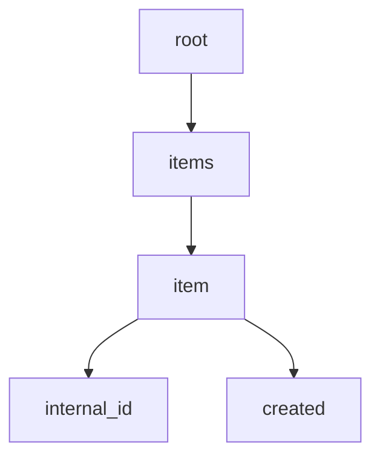

# Import Data Format
To import property, please folow JSON creation guide. All properties should reside in `items` array in `item` object.

## Item

| Section | Key | Description | Type | Requiered |
| --- | --- | --- | --- | --- |
| `/` | `internal_id` | Internal ID from your system. Used to match item during update | `int` \| `string` | Yes |
| `/` | `created` | Item creation date on your system. | `Y-m-d H:i:s` | No |
| `/` | `modified` | Item modified date on your system. | `Y-m-d H:i:s` | Yes |
| `/` | `io_estates_type` | Item modified date on your system. Use `id` of [IO_EstatesType](#io_estatestype). At least one must be provided, and in some cases you can use two or more. | `int[]` | Yes |
| `/` | `title` | Item title. | `string` | Yes |
| `/` | `content` | Item description with basic HTML tags (`a`, `b`, `ul`, `ol`, `li` ) | `string` \| `html` | Yes |
| `/meta` | `io_estates_currency` | Sets price currency. Default is `BAM`. | `EUR`\|`BAM` | No |
| `/meta` | `io_estates_price` | Price of item. If it is not provided, item will be bresented with 'Ask for price' | `double` | No |
| `/meta` | `io_estates_address` | Used to set street name and number | `string` | No |
| `/meta` | `io_estates_zip` | ZIP code (eg. 78000) | `string` | No |
| `/meta` | `io_estates_city` | City of property | `string` | No |
| `/meta` | `io_estates_region` | Region of item | `string` | No |
| `/meta` | `io_estates_state` | State of item | `string` | No |
| `/meta` | `io_estates_bathrooms` | Number of bathrooms in the property | `int` | No |
| `/meta` | `io_estates_sqm` | Property size in square meters| `int` | No |
| `/meta` | `io_estates_land` | Land related to the property in square meters | `int` | No |
| `/meta` | `io_estates_geo` | Used to present position of property on the map.  | {`lat`:`double`, `lng`:`double`}, | No |
| `/meta` | `io_estates_mode` | Declares desired action related to the property. Use `string` of [IO_EstatesMode](#io_estatesmode). | `sell` \| `buy` \| `rent` \| `lease` | Yes |
| `/meta` | `io_estates_payment` | Defines payment interval if `io_estates_mode` is `lease` \| `rent`. Use `string` of `IO_EstatesPaymentInterval`. | `month` \| `day` \| `null` | * |
| `/meta` | `io_estates_builded` | If applicable, used to set year when the property is builded.  | `int`  | No |
| `/meta` | `io_estates_video` | To include promo video, you can provide YouTube embed URL.  | `URL`  | No |
| `/meta` | `io_estates_panorama360` | To present 360&deg; panorama, you can an URL.  | `URL`  | No |
| `/` | `io_estates_loc` | Include in `id` from [IO_EstatesLocations](#io_estateslocations) to set location. If this is not set, system will try to resolve location on it's own by using `io_estates_city`,  `io_estates_region` and `io_estates_state`. We strongly recommend that you provide this on your own. | `int`  | Yes* |
| `/` | `io_estates_rooms` | Number of rooms in the property. Please be aware that you need to send an `id` of IO_EstatesRooms  | `int`  | No |


```json
{
 "items": [
  {
   "internal_id": 1000
   "created": "2023-01-01 09:28:42",
   "modified": "2023-03-02 09:28:42",
   "io_estates_type": [
    8,
    9
   ],
   "title": "Amazing house for rent",
   "content": "Amazing apartment for rent content... We will accept simple HTML...",
   "meta": {
    "io_estates_currency": "EUR",
    "io_estates_price": 1200,
    "io_estates_address": "Durmitorska 18",
    "io_estates_zip": "11001",
    "io_estates_city": "Beograd",
    "io_estates_region": "Beograd",
    "io_estates_state": "Srbija",
    "io_estates_bathrooms": 1,
    "io_estates_sqm": 90,
    "io_estates_land": 250,
    "io_estates_geo": {
     "lat": 44.8003986,
     "lng": 20.4530811
    },
    "io_estates_mode": "rent",
    "io_estates_payment": "month",
    "io_estates_builded": 2023,
    "io_estates_video": "https://www.youtube.com/embed/dQw4w9WgXcQ",
    "io_estates_panorama360": "https://pixexid.com/image/cm1btua-360-image-of-a-room"
   },
   "io_estates_loc": 311,
   "io_estates_rooms": 39,
   "io_estates_floors": 44,
   "io_estates_level": null,
   "io_estates_heating": 52,
   "io_estates_condition": 308,
   "io_estates_equip": 62,
   "io_estates_attr": [
    66,
    67,
    240
   ],
   "io_estates_waste": 245,
   "io_estates_storey": 249,
   "images": [
    "https://nadjistan.ba/wp-content/themes/nadjistan/assets/img/shop/categories/sarajevo.jpg",
    "https://nadjistan.ba/wp-content/themes/nadjistan/assets/img/shop/categories/trebinje.jpg",
    "https://nadjistan.ba/wp-content/themes/nadjistan/assets/img/shop/categories/banjaluka.jpg",
    "https://nadjistan.ba/wp-content/themes/nadjistan/assets/img/shop/categories/prijedor.jpg"
   ]
  },
  {
   "internal_id": 1010,
   "created": "2023-01-01 09:28:42",
   "modified": "2023-03-02 09:28:42",
   "io_estates_type": [
    23
   ],
   "title": "Amazing apartment for sell",
   "content": "Amazing apartment for sell content...\n\nWe will accept simple HTML...",
   "meta": {
    "io_estates_currency": "BAM",
    "io_estates_price": 260000,
    "io_estates_address": "Durmitorska 18",
    "io_estates_zip": "78101",
    "io_estates_city": "Banja Luka",
    "io_estates_region": "Republika Srpska",
    "io_estates_state": "BiH",
    "io_estates_bathrooms": 3,
    "io_estates_sqm": 120,
    "io_estates_land": null,
    "io_estates_geo": null,
    "io_estates_mode": "sell",
    "io_estates_payment": null,
    "io_estates_builded": 2023,
    "io_estates_video": "https://www.youtube.com/embed/dQw4w9WgXcQ",
    "io_estates_panorama360": "https://pixexid.com/image/cm1btua-360-image-of-a-room"
   },
   "io_estates_loc": 311,
   "io_estates_rooms": 39,
   "io_estates_floors": 44,
   "io_estates_level": 86,
   "io_estates_heating": 52,
   "io_estates_condition": 308,
   "io_estates_equip": 62,
   "io_estates_attr": [
    67
   ],
   "io_estates_waste": 246,
   "io_estates_storey": null,
   "images": [
    "https://nadjistan.ba/wp-content/themes/nadjistan/assets/img/shop/categories/sarajevo.jpg",
    "https://nadjistan.ba/wp-content/themes/nadjistan/assets/img/shop/categories/trebinje.jpg",
    "https://nadjistan.ba/wp-content/themes/nadjistan/assets/img/shop/categories/banjaluka.jpg",
    "https://nadjistan.ba/wp-content/themes/nadjistan/assets/img/shop/categories/prijedor.jpg"
   ]
  }
 ]
}
```




## IO_EstatesMode
This is one of the most important taxonomies. You can use hardcoded values:

```
class  IO_EstatesMode
{
  const Buy = 'buy';
  const Sell = 'sell';
  const Rent = 'rent';
  const Lease = 'lease';
}
```


## IO_EstatesType
This is one of the most important taxonomies. If you are using values from the REST endpoint, please note that you'll need to provide one ID where `parent` is 0 and you can provide one subitem of that parent if it exists.

| Lvl 1 | Lvl 2 | ID |
| --- | --- | --- |
| Homes |  | 8 |
|  |  Duplex | 9 |
|  |  Montazna | 10 |
|  |  Samostalna | 11 |
|  |  Vikendica | 11 |


You can use hardcoded values:
```
class IO_EstatesType
{
  const Homes = 8;
  const Garage = 3;
  const Office = 13;
  const Apartment = 23;
  const Land = 24;
}
```
Or fetch data from on following endpoint:
`/wp-json/wp/v2/io_estates_type`


## IO_EstatesWaste
This taxonomy is used to set waste for property.

You can use hardcoded values:

```
class IO_EstatesWaste
{
  const None = 247;
  const Public = 246;
  const CessPit = 245;
}
```
Or fetch data from on following endpoint:
`/wp-json/wp/v2/io_estates_waste`

## IO_EstatesRooms
Taxonomy is used to specify number of rooms for a property. Can be used only with Home and Apartment `IO_EstatesType`.
```
class IO_EstatesRooms
{
  const Studio = 38;
  const OneRoom = 39;
  const TwoRooms = 37;
  const ThreeRooms = 40;
  const FourRooms = 41;
  const FiveAndMoreRooms = 42;
}
```
Or fetch data from on following endpoint:
`/wp-json/wp/v2/io_estates_rooms`


## IO_EstatesHeating
Taxonomy is used to specify heating method. It is meaningfull only to Home and Apartment `IO_EstatesType`.
```
class IO_EstatesHeating
{
  const Wood = 51;        // drva
  const City = 52;        // gradsko
  const BoilerRoom = 53;  // kotlovnica u zgradi
  const Other = 54;       // ostalo
  const Gas = 55;         // plin
  const Floor = 56;       // podno grijanje
  const Electricity = 57; // el. energija
}
```
Or fetch data from on following endpoint:
`/wp-json/wp/v2/io_estates_heating`

## IO_EstatesAttributes
Taxonomy is used to specify additional atributes of the property. 
```
class IO_EstatesAttributes
{
  const AutomatskaVrata = 65;
  const Alarm = 66;
  const Balkon = 67;
  const Bazen = 240;
  const Klima = 68;
  const Lift = 69;
  const Podrum = 241;
  const Shupa = 241;
  const Uknjizeno = 71;
  const VideoNadzor = 70;
}
```
Or fetch data from on following endpoint:
`/wp-json/wp/v2/io_estates_attr`

## IO_EstatesCondition
```
class IO_EstatesCondition
{
  const New = 59;
  const Good = 308;
  const Renovated = 60;
  const Old = 309;
}
```
Or fetch data from on following endpoint:
`/wp-json/wp/v2/io_estates_condition`


## IO_EstatesEquipment
```
class IO_EstatesEquipment
{
  const Equipped = 62;
  const Unequipped = 63;
  const Semiequipped = 64;
}
```
Or fetch data from on following endpoint:
`/wp-json/wp/v2/io_estates_equip`

## IO_EstatesPaymentInterval
```
class IO_EstatesPaymentInterval
{
  const Month = 'month';
  const Day = 'day';
  const None = null;
}
```
